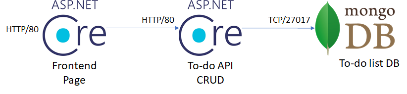

# Docker Kubernetes Workshop
This is a walkthrough to create an PoC with Docker & Kubernetes in a development-like situation. It focuses in the following cases:

## Pre-requisites


* Docker [download](https://docs.docker.com/docker-for-windows/install/)
* MongoDB Compass Community [download](https://docs.mongodb.com/compass/master/install/)
* Install VS Code [here](https://code.visualstudio.com/download)
* Install Azure CLI [here](https://docs.microsoft.com/en-us/cli/azure/install-azure-cli?view=azure-cli-latest)

* Clone this repo, ```git clone https://github.com/marvin-garcia/AksWorkshop.git```


## Create Container Registry - Docker Hub  https://hub.docker.com/

1. Create an account on docker hub to own the Docker images. 
2. Log in to the contrainer registry, run the following 
command ```docker login ```.

## Deploy Microservices Application



### Deploy Backend API

9. In a real life scenario you will own your Docker images, so in the next step you will have to pull the backend image and push it to your new container registry:
    ```powershell
    docker pull marvingarcia/todo-backend-api
    docker tag marvingarcia/todo-backend-api aksworkshop/backend-api
    docker push aksworkshop/backend-api
    ```

10. Create a deployment and service YAML files for the backend API. It should comply with the following requirements:
    * At least 2 replicas
    * Liveness and readiness probes pointing to the swagger page (/swagger/index.html)
    * Resources requests and limits    

11. Create the deployment and service in the cluster. You may use the command ```kubectl apply```, Helm charts or Azure DevOps to manage the release. If you have time constraints, just use the [templates](MultitierApi/BackendApi/Helm/) provided in this lab. It is recommended to use [Azure DevOps](DevOps/README.md) since releases will be automated that way. You can also use the script [helm-create-release.ps1](Scripts/helm-create-release.ps1) to push releases manually to the cluster.

12. Use the command ```kubectl port-forward``` to test the Backend API using the Swagger page.
    ```powershell
    kubectl port-forward --namespace default svc/<backend-service-name> 8080:80;
    ```

### Deploy Frontend API

13. Pull the Frontend API docker image and push it to your registry:
    ```powershell
    docker pull marvingarcia/todo-frontend-api
    docker tag marvingarcia/todo-frontend-api <you-login-server>.azurecr.io/aksworkshop/frontend-api
    docker push <you-login-server>.azurecr.io/aksworkshop/frontend-api
    ```

15. Create a deployment, service and ingress controller YAML files for the frontend API. It should comply with the following requirements:
    * At least 2 replicas
    * Liveness and readiness probes pointing to the swagger page (/swagger/index.html)
    * Resources requests and limits    
    * Must not be exposed to the Internet.

16. Create the deployment and service in the cluster. You may use the command ```kubectl apply```, Helm charts or Azure DevOps to manage the release. If you have time constraints, just use the [templates](MultitierApi/Helm/) provided in this lab. It is recommended to use [Azure DevOps](DevOps/README.md) since releases will be automated that way. You can also use the script [helm-create-release.ps1](Scripts/helm-create-release.ps1) to push releases manually to the cluster.

17. Use the command ```kubectl port-forward``` to test the Frontend API using the Swagger page.
    ```powershell
        kubectl port-forward --namespace default svc/<frontend-service-name> 8080:80;
    ```

## Next Steps

At this point it is up to you if you want to play any further with the App Gateway to check SSL termination and firewall settings to protect your application, or if you want to create your own firewalls (ie: Palo Alto) inside the virtual network and redirect traffic to them.

You can also try creating NSGs for every subnet and isolate traffic to specific sources. For example you could allow access to the cluster network only from the App Gateway subnet and deny everything else, and you can whitelist the external IP addresses that can reach out to your App Gateway for additional security.
